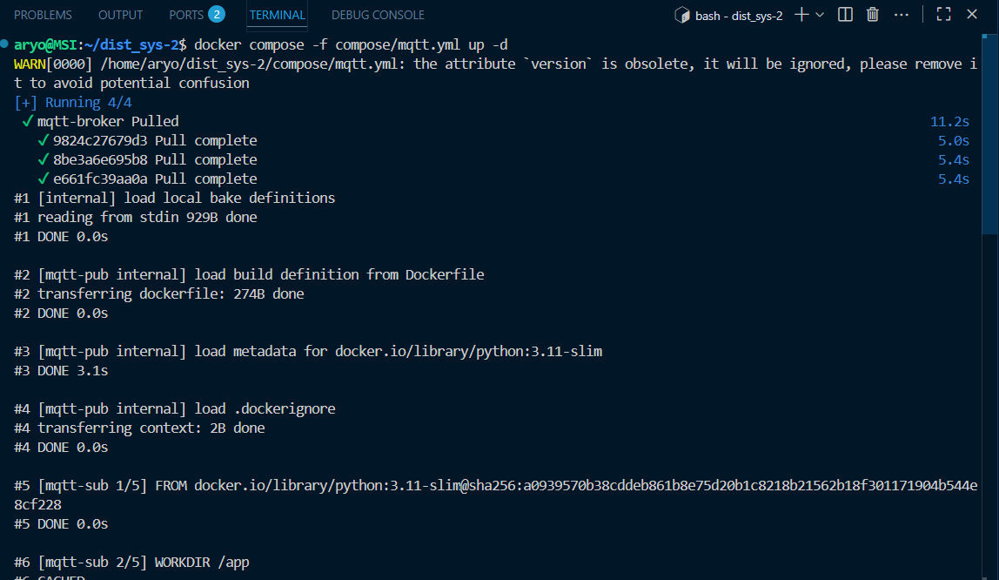
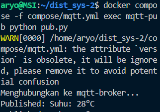
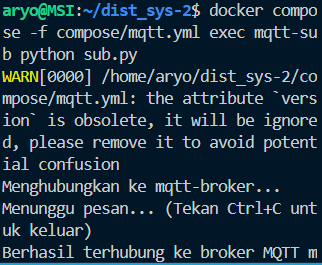
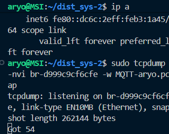
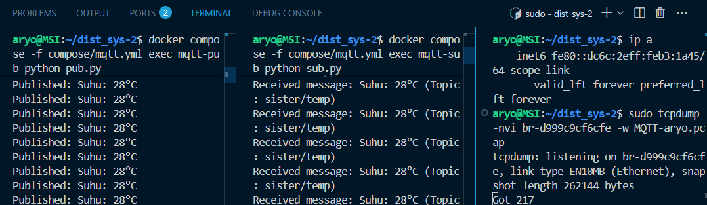
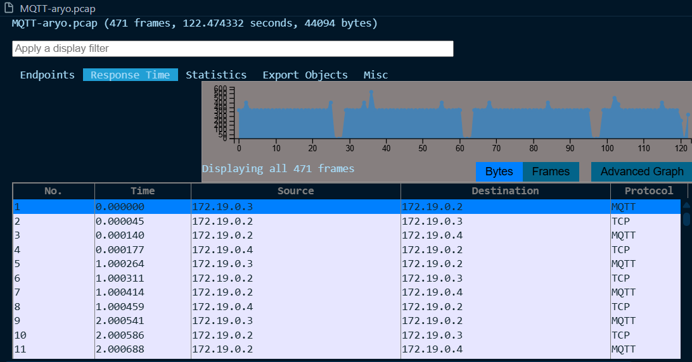
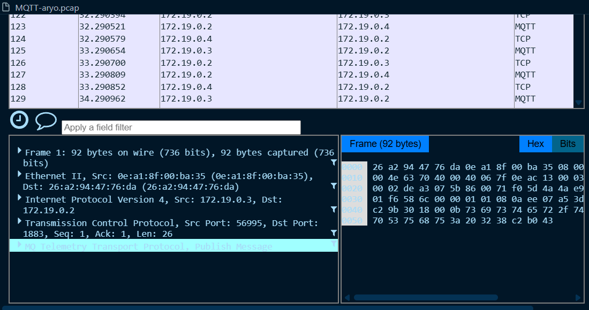
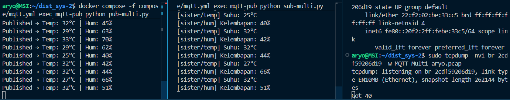
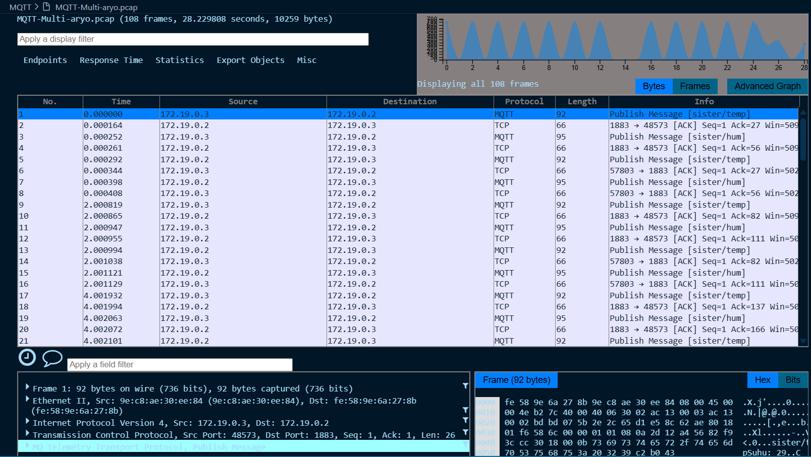

# Praktikum MQTT
MQTT (Message Queuing Telemetry Transport) adalah protokol komunikasi ringan berbasis publish/subscribe.
Biasanya dipakai di IoT (Internet of Things) karena hemat bandwidth, cepat, dan cocok untuk device dengan resource terbatas.
<br>

Memiliki: <br> 1. Broker: pusat komunikasi (contoh: Mosquitto). Semua pesan lewat sini. <br> 2. Publisher: pengirim pesan ke suatu topic. <br> 3. Subscriber: penerima pesan dari topic

## Perintah yang akan dijalankan untuk menjalankan MQTT:

### 1. Jalankan Perintah
```docker compose -f compose/mqtt.yml up -d```
### untuk build docker pada pengujian MQTT

### 2. Jalankan Perintah
```docker compose -f compose/mqtt.yml exec mqtt-pub python pub.py```
### untuk menjalankan server pada file ```pub.py``` sebagai publisher

<br>
 Dapat dilihat pada gambar di atas ```pub.py``` saat dijalankan mengrimkan data suhu ``` Published: Suhu: 28°C``` -> ke ```broker``` -> ```topic```

### 3. Jalankan Perintah
```docker compose -f compose/mqtt.yml exec mqtt-sub python sub.py```
### untuk menjalankan client pada file ```sub.py```

<br>
dapat dilihat pada gambar diatas ```sub.py``` menghubungkan data suhu yang ada di ```broker``` lalu diterima ke ```subscriber```

### 4. Sebelum melakukan pengujian jalankan 
`ip a`
### mencari bridge interface yang digunakan container untuk melakukan packet capturing

### 5. Sebelum melakukan pengujian jalankan 
```sudo tcpdump -nvi br-(sesuaikan) -w (namafile).pcap```

### 6. Pada bagian ```Publisher``` -> ```Broker``` ->```Subcriber``` 

### 7. Setelah itu anda dapat memonitor pada file .pcap


<br>
Pada gambar diatas, terdapat 2 jenis protokol yaitu MQTT dan TCP yang melakukan looping untuk mengirim pesan. ```Publisher``` menggunakan protokol MQTT untuk mengirim pesan ke subscibernya sedangkan ```subscriber``` menggunakan **protokol TCP** untuk mengirimkan pesan **ACK** atau Acknowledgement, yang berarti pesan **MQTT** dari `publisher` sudah sampai ke `subscriber` dan subscriber mengonfirmasinya Port yang digunakan  `port 1883`

### 8. Percobaan Multi `SUB` dan `PUB`
```
docker compose -f compose/mqtt.yml exec mqtt-pub python pub-multi.py

docker compose -f compose/mqtt.yml exec mqtt-pub python sub-multi.py
```
Menjalankan kedua perintah dengan langkah langkah sebelumnya. Mendapatkan hasil
 Publihser| Subriber |
|---------|---------|
|`Published → Temp: 28°C Hum: 58%`|`[sister/hum]Kelembapan: 63% [sister/temp] Suhu: 28°C`|
<br>




visulaisasi dari wireshark



