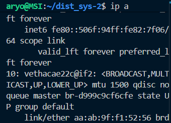

# Praktikum MQTT
## Perintah yang akan dijalankan :

### 1 jalankan Perintah
docker compose -f compose/mqtt.yml up -d
### untuk build docker pada pengujian MQTT

### 2. jalankan Perintah
docker compose -f compose/mqtt.yml exec mqtt-pub python pub.py
### untuk menjalankan server pada file pub.py sebagai publisher

### 3. jalankan Perintah
docker compose -f compose/mqtt.yml exec mqtt-sub python sub.py
### untuk menjalankan client pada file sub.py

### 4. Sebelum melakukan pengujian jalankan 
ip a
### untuk mencari bridge interface yang digunakan container untuk melakukan packet capturing

### 5. Sebelum melakukan pengujian jalankan 
sudo tcpdump -nvi br-(sesuaikan) -w (namafile).pcap

### 6. pada bagian client masukkan pesan pesan yang nantinya akan diterima di server

### 7. Setelah itu anda dapat memonitor pada file .pcap

