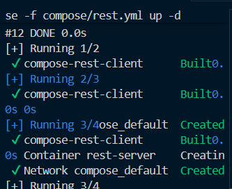
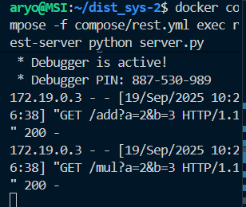
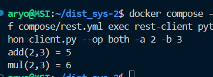
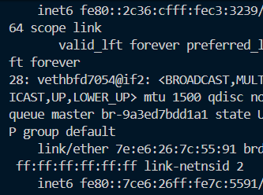
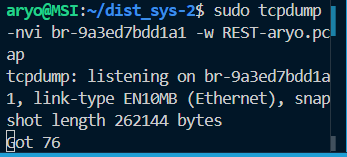
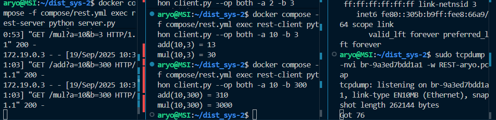
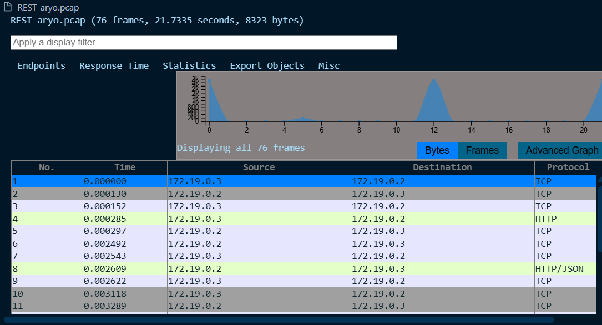
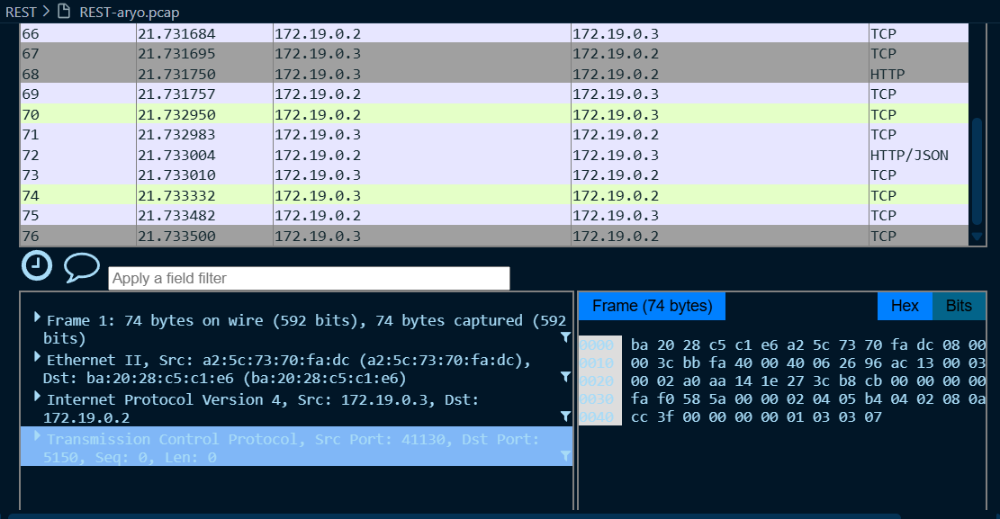

# Praktikum REST
REST (Representational State Transfer) adalah gaya arsitektur komunikasi berbasis HTTP.

Dalam REST, komunikasi dilakukan dengan endpoint URL seperti /add atau /mul yang bisa dipanggil oleh client.

Client tidak berhubungan langsung dengan socket seperti di TCP/UDP, melainkan menggunakan protokol HTTP (umumnya method GET, POST, PUT, DELETE).

Keuntungan REST:

- Mudah diakses (bisa langsung dites pakai curl atau browser).

=  Lebih standar dibanding raw TCP/UDP.

- Cocok untuk aplikasi web, API publik, dan sistem terdistribusi modern.
## Perintah yang akan dijalankan :

### 1 jalankan Perintah
`docker compose -f compose/rest.yml up -d`
### untuk build docker pada pengujian REST

### 2. jalankan Perintah
`docker compose -f compose/rest.yml exec rest-server python server.py`
### untuk menjalankan server pada file server.py

Server listen di semua interface, port 5150, supaya bisa diakses dari luar container.

### 3. jalankan Perintah
`docker compose -f compose/rest.yml exec rest-client python client.py --op both -a 2 -b 3`
### untuk menjalankan client pada file client.py

client akan mengakses service rest-server pada `port 5150`  -> Mengirim request GET ke endpoint dengan code `a 2 -b 3`-> program selesai dengan exit code sesuai hasil
### 4. Sebelum melakukan pengujian jalankan 
`ip a`
### untuk mencari bridge interface yang digunakan container untuk melakukan packet capturing

### 5. Sebelum melakukan pengujian jalankan 
`sudo tcpdump -nvi br-(sesuaikan) -w (namafile).pcap`
 

### 6. pada bagian client masukkan pesan pesan yang nantinya akan diterima di server

### 7. Setelah itu anda dapat memonitor pada file .pcap

