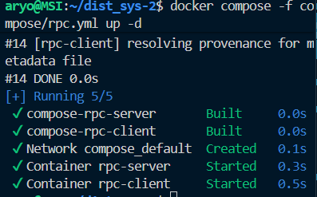
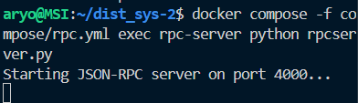
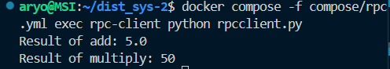
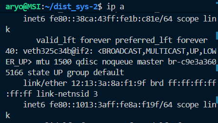
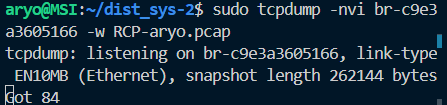
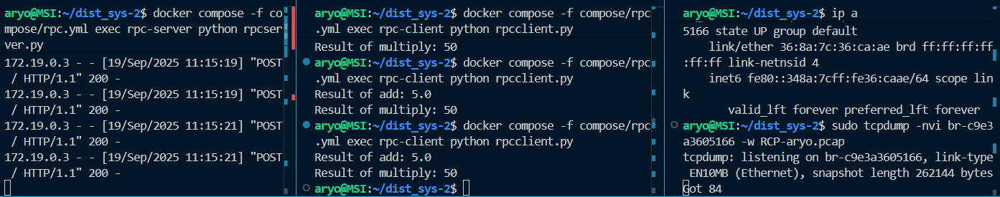
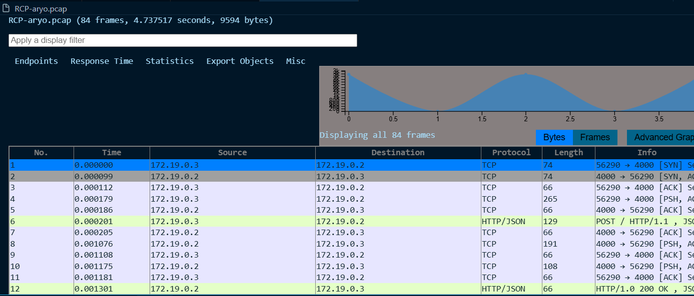
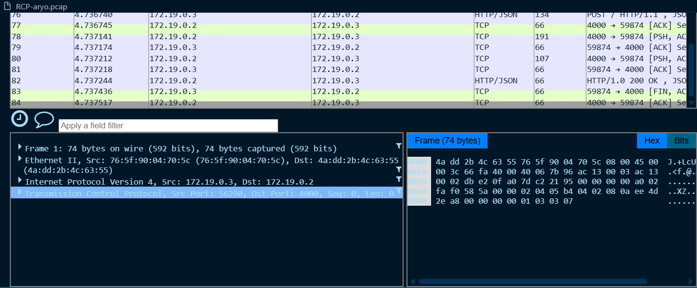

# Praktikum RPC
RPC (Remote Procedure Call) adalah mekanisme agar sebuah program bisa memanggil fungsi/prosedur di komputer lain seolah-olah fungsi itu ada secara lokal.

Jadi client cukup panggil fungsi add(10, 2), dan RPC framework yang mengurus pengiriman request, eksekusi di server, dan balikan hasil.
## Perintah yang akan dijalankan :

### 1 jalankan Perintah
`docker compose -f compose/rpc.yml up -d`
### untuk build docker pada pengujian RPC

### 2. jalankan Perintah
`docker compose -f compose/rpc.yml exec rpc-server python rpcserver.py`
### untuk menjalankan server pada file rpcserver.py


mendaftarkan fungsi agar bisa dipanggil lewat RPC -> add(a,b) -> multiply(a,b) -> RequestHandler -> Server listen di `port 4000` pakai `HTTPServer`.

### 3. jalankan Perintah
`docker compose -f compose/rpc.yml exec rpc-client python rpcclient.py`
### untuk menjalankan client pada file rpcclient.py


client panggil:
```
add(10,2) → karena server pakai /, hasilnya = 5.0.

multiply(10,5) → hasilnya 50.
```

### 4. Sebelum melakukan pengujian jalankan 
`ip a`
### untuk mencari bridge interface yang digunakan container untuk melakukan packet capturing

### 5. Sebelum melakukan pengujian jalankan 
`sudo tcpdump -nvi br-(sesuaikan) -w (namafile).pcap`

### 6. pada bagian client masukkan pesan pesan yang nantinya akan diterima di server

### 7. Setelah itu anda dapat memonitor pada file .pcap


