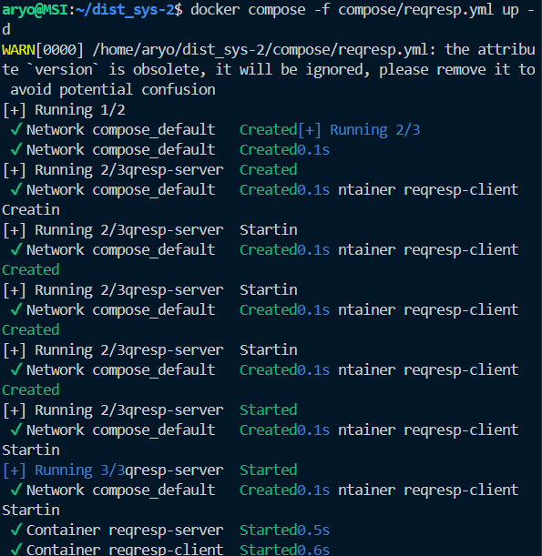
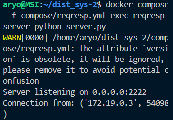
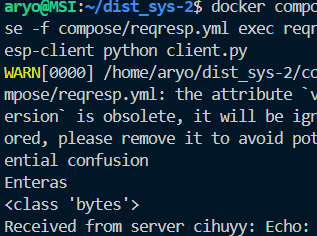
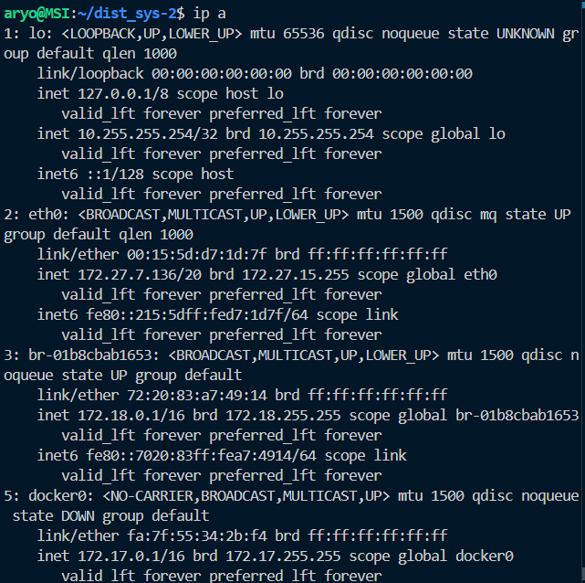
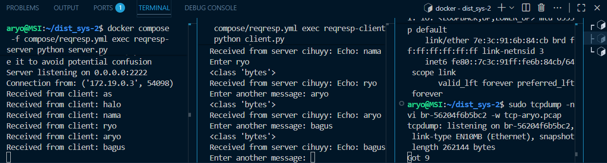
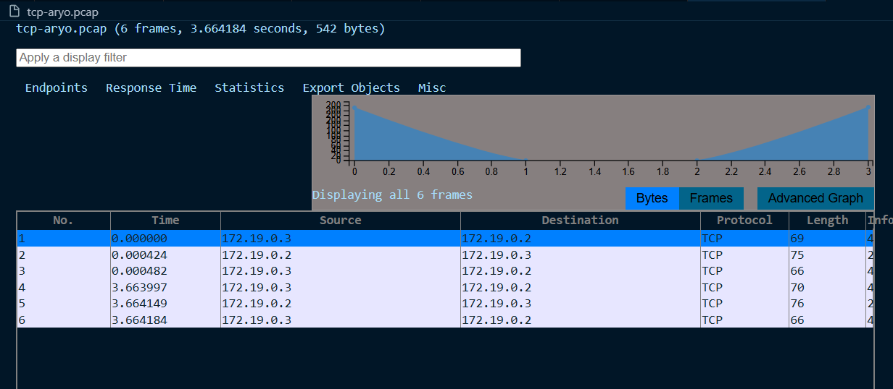
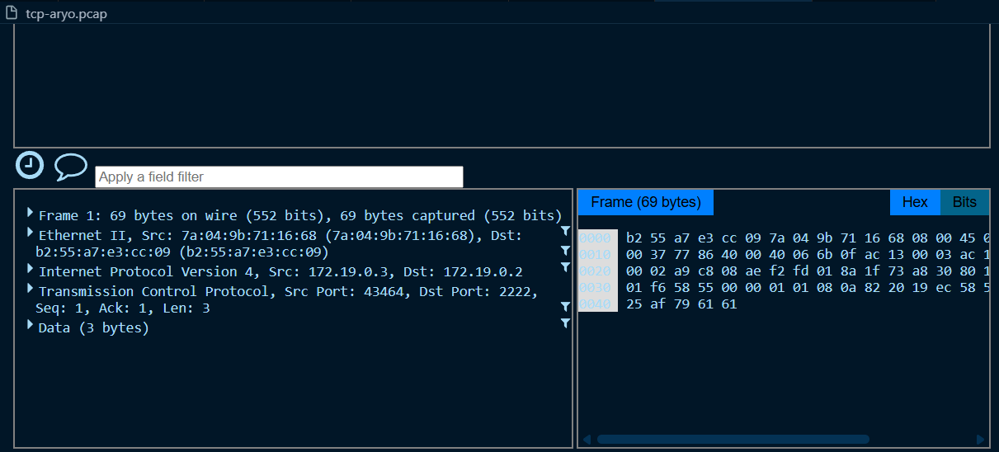
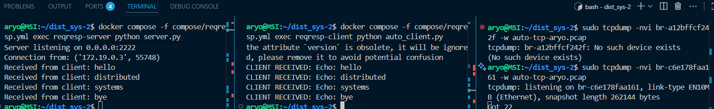
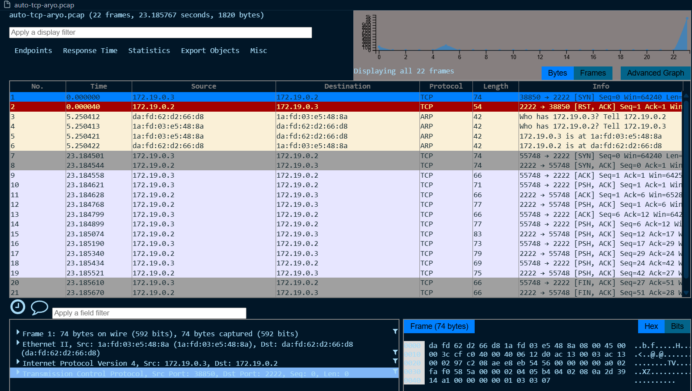

# Praktikum Reqresp TCP

TCP (Transmission Control Protocol) adalah protokol transport yang connection-oriented -> harus ada handshake dulu sebelum data bisa dikirim.

Di pola ReqResp, komunikasi berjalan sbb:

Client request (mengirim pesan).

Server response (balas sesuai request).

Alurnya mirip chatting -> kirim, tunggu balasan, kirim lagi.

Berbeda dengan UDP, TCP menjamin reliabilitas (urutan pesan terjaga, tidak hilang).
## Perintah yang akan dijalankan :

### 1. Jalankan Perintah
`docker compose -f compose/reqresp.yml up -d`
### untuk build docker pada pengujian reqresp

### 2. Jalankan Perintah
`docker compose -f compose/reqresp.yml exec reqresp-server python server.py`
### untuk menjalankan server pada file server.py

 server listen di semua interface `port 2222` -> tunggu `client` konek -> balas pesan ke `client`.

Loop berjalan terus sampai `client` disconnect

### 3. jalankan Perintah
`docker compose -f compose/reqresp.yml exec reqresp-client python client.py`
### untuk menjalankan client pada file client.py

konek ke service `server` -> `user` mengetik pesan -> kirim ke `server` -> tunggu balasan -> tutup koneksi.

Ini manual perlu user ketik pesan.

### 4. Sebelum melakukan pengujian jalankan 
`ip a`
### untuk mencari bridge interface yang digunakan container untuk melakukan packet capturing

### 5. Sebelum melakukan pengujian jalankan 
`sudo tcpdump -nvi br-(sesuaikan) -w (namafile).pcap`
### 6. pada bagian client masukkan pesan pesan yang nantinya akan diterima di server

### 7. Setelah itu anda dapat memonitor pada file .pcap

### 8. Menggunakan `auto_client.py`

menghasilkan

pada file `.pcap`

Perbedaan

| Aspek          | Client Manual                              | Client Auto                                            |
| -------------- | ------------------------------------------ | ------------------------------------------------------ |
| Input pesan    | User ketik manual lewat terminal           | Sudah ditentukan di kode (`hello`, `distributed`, dll) |
| Interaktivitas | Interaktif, user bisa kirim pesan apa saja | Non-interaktif, jalan otomatis                         |
| Kegunaan       | Simulasi chat / latihan request-response   | Testing otomatis, simulasi sistem tanpa user           |
| Kapan berhenti | User ketik `bye`                           | Kode berhenti setelah kirim pesan terakhir             |
