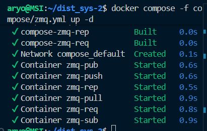
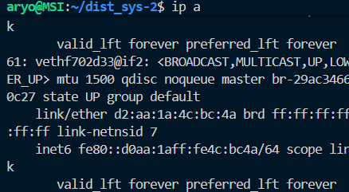
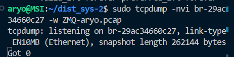
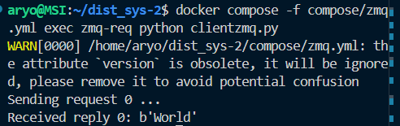
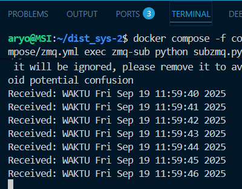
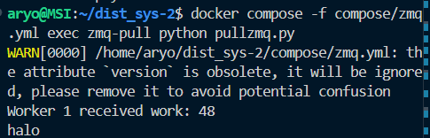
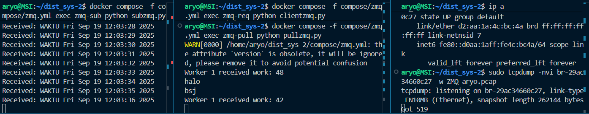
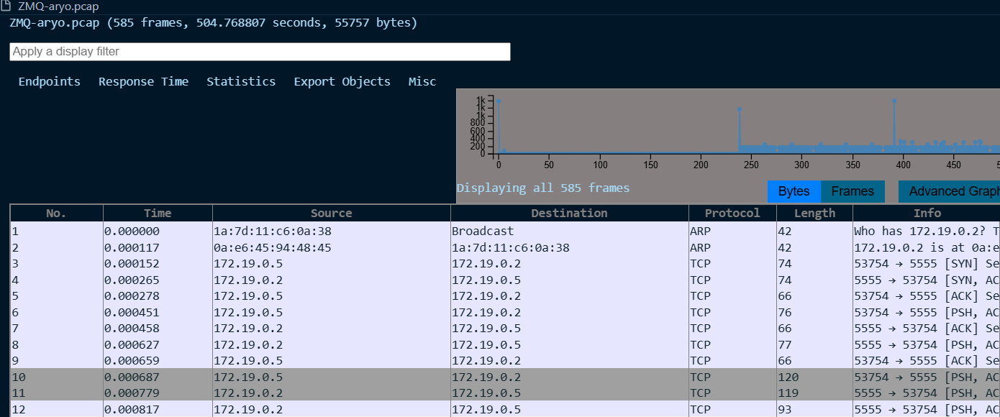
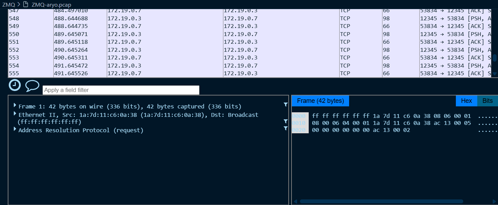

# Praktikum ZMQ
## Perintah yang akan dijalankan :

### 1 jalankan Perintah
docker compose -f compose/zmq.yml up -d
### untuk build docker pada pengujian ZMQ

### 2. Sebelum melakukan pengujian jalankan 
ip a
### untuk mencari bridge interface yang digunakan container untuk melakukan packet capturing

### 3. Sebelum melakukan pengujian jalankan 
sudo tcpdump -nvi br-(sesuaikan) -w (namafile).pcap

### 4. jalankan Perintah
docker compose -f compose/zmq.yml exec zmq-req python clientzmq.py
### untuk menjalankan server pada file clinetzmq.py

### 5. jalankan Perintah
docker compose -f compose/zmq.yml exec zmq-sub python subzmq.py

### 5. jalankan Perintah
docker compose -f compose/zmq.yml exec zmq-pull python pullzmq.py
### untuk menjalankan client pada file client.py

### 6. pada bagian client masukkan pesan pesan yang nantinya akan diterima di server

### 7. Setelah itu anda dapat memonitor pada file .pcap

