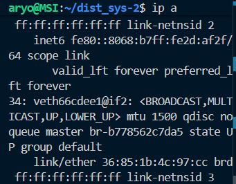

# Praktikum oneway UDP
UDP (User Datagram Protocol) adalah protokol transport ringan (layer 4) yang connectionless -> tidak ada handshake seperti TCP.
## Perintah yang akan dijalankan :

### 1, Jalankan Perintah
`docker compose -f compose/udp.yml up -d`
### untuk build docker pada pengujian oneway UDPT

### 2. jalankan Perintah
`docker compose -f compose/udp.yml exec udp-server python serverUDP.py`
### untuk menjalankan server pada file serverUDP.py

Server UDP dibuat pakai `socket.SOCK_DGRAM.`

Bind ke semua `IP (0.0.0.0) port 12345.`

Server siap nerima data pakai `recvfrom(1024).`

Saat dapat data, server mencetak pesan dan mengirim respons balik.

### 3. jalankan Perintah
`docker compose -f compose/udp.yml exec udp-client python clientUDP.py`

Client bikin socket UDP → kirim pesan ke server `(udp-server, port 12345).`

### untuk menjalankan client pada file clientUDP.py

### 4. Sebelum melakukan pengujian jalankan 
`ip a`
### untuk mencari bridge interface yang digunakan container untuk melakukan packet capturing

### 5. Sebelum melakukan pengujian jalankan 
`sudo tcpdump -nvi br-(sesuaikan) -w (namafile).pcap`

### 6. pada bagian client masukkan pesan pesan yang nantinya akan diterima di server

### 7. Setelah itu anda dapat memonitor pada file `.pcap`

### 8. Explorasi
Menjalankan kedua perintah dengan langkah langkah sebelumnya. Mendapatkan hasil
 Peran|  code  |  Hasil   |
|------|-------|----------|
|`server-1`|`docker compose -f compose/udp.yml exec udp-server python server-1.py`|`[RECEIVED] dari ('172.19.0.3', 56235) : Pesan UDP ke-0 [RECEIVED] dari ('172.19.0.3', 56235) : Pesan UDP ke-1[RECEIVED] dari ('172.19.0.3', 56235) : Pesan UDP ke-2[RECEIVED] dari ('172.19.0.3', 56235) : Pesan UDP ke-3[RECEIVED] dari ('172.19.0.3', 56235) : Pesan UDP ke-4`|
|`client-1`|`docker compose -f compose/udp.yml exec udp-client python client-1.py`|`[SENT] Pesan UDP ke-0[SENT] Pesan UDP ke-1[SENT] Pesan UDP ke-2[SENT] Pesan UDP ke-3 [SENT] Pesan UDP ke-4Semua pesan sudah dikirim (oneway).`|

 

memonitor pada file `.pcap`

