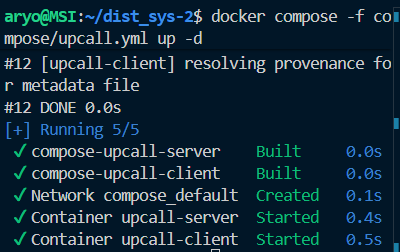
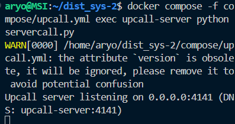
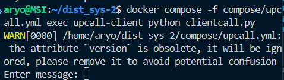
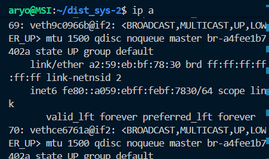
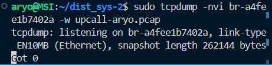
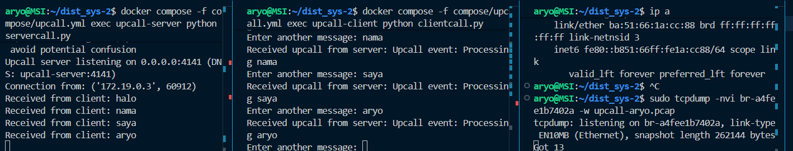
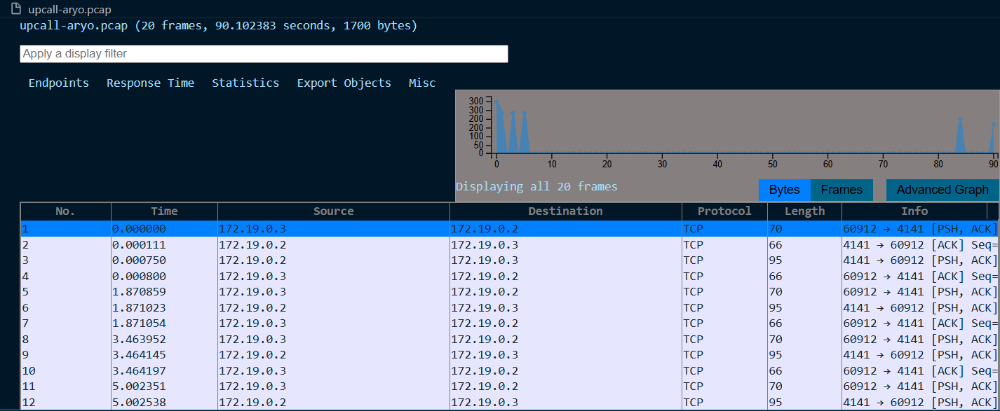
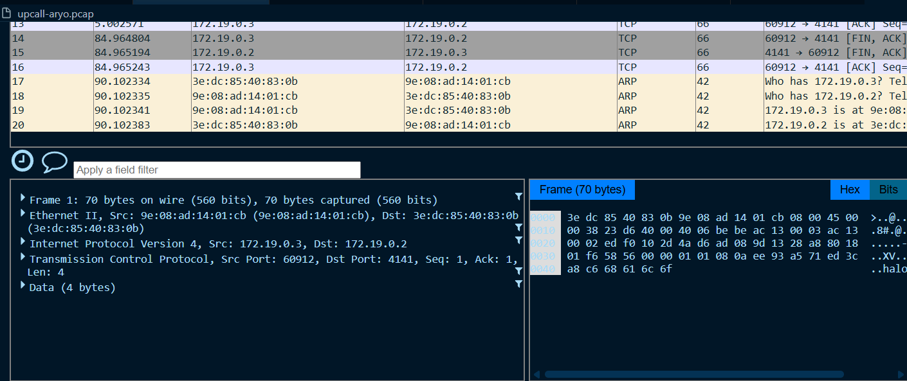

# Praktikum UPCALL
Upcall adalah teknik komunikasi di mana server secara aktif mengirim event atau callback balik ke client setelah menerima sesuatu, bukan hanya sekadar membalas request.

Bisa dianggap kebalikan dari RPC: kalau RPC itu client memanggil fungsi di server, maka upcall itu server yang "memanggil balik" fungsi di client (atau minimal mengirim event/response aktif).

Dalam implementasi sederhana (seperti kodenya), server mengirimkan pesan event otomatis setiap kali menerima input dari client.

Konsep ini dekat dengan event-driven systems, mirip push notification, websocket, atau callback dalam sistem distributed.

## Perintah yang akan dijalankan :

### 1 jalankan Perintah
`docker compose -f compose/upcall.yml up -d`
### untuk build docker pada pengujian upcall

### 2. jalankan Perintah
`docker compose -f compose/upcall.yml exec upcall-server python servercall.py`
### untuk menjalankan server pada file servercall.py

Server listen di `port 4141` ->Setelah client connect, server masuk ke loop -> Terima data dari client -> Print data di console server -> Kirim balik ke client pesan otomatis "Upcall event"

### 3. jalankan Perintah
`docker compose -f compose/upcall.yml exec upcall-client python clientcall.py`
### untuk menjalankan client pada file clientcall.py

Client connect ke `upcall-server:4141` -> User input message → dikirim ke server -> Server membalas dengan pesan upcall → client langsung menampilkannya => Loop sampai user ketik bye.

### 4. Sebelum melakukan pengujian jalankan 
ip a
### untuk mencari bridge interface yang digunakan container untuk melakukan packet capturing

### 5. Sebelum melakukan pengujian jalankan 
sudo tcpdump -nvi br-(sesuaikan) -w (namafile).pcap

### 6. pada bagian client masukkan pesan pesan yang nantinya akan diterima di server

### 7. Setelah itu anda dapat memonitor pada file .pcap

